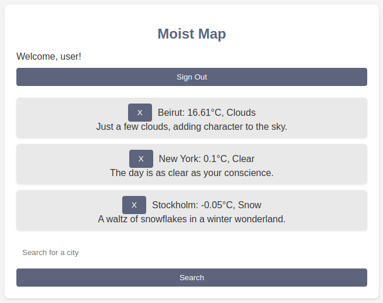

# Moist Map - A web development project in Interaction Programming and the Dynamic Web 
<b>University</b>: KTH Royal Institute of Technology, Stockholm, Sweden  
<b>Course code</b>: DH2642  

## About:
Moist Map is a web application that shows the current weather in the world. The application is built with React and uses the OpenWeatherMap API to fetch weather data. The user can also save their favorite cities to their profile. They also get a fun quote accompanying the weather conditions in there saved cities. 

## How to run locally: 
- Clone the repository
- `cd` into the project folder 
- `npm install` to install dependencies
- `npm start` to start the server

### Need to have:
- API key from [OpenWeatherMap](https://openweathermap.org/api) --> put in apiConfig.js file in root 
- Firebase project --> put in firebaseConfig.js file in src folder 

### Website: [Moist-Map](https://moist-map.web.app/)
